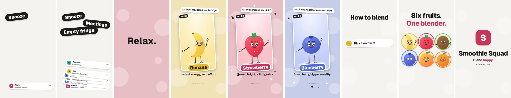

# motion-video-skill

Playful, polished motion-graphics videos from one JSON file, made to be driven
by an AI agent (or by you).

Write a `story.json` with your scenes and lines. The engine renders every frame
in headless Chromium, gives each character its own ElevenLabs voice synced word
by word, synthesizes music and sound effects on the same cues, and encodes an
MP4. Vertical for TikTok, Reels and Shorts, or 16:9 and square.



▶ [Watch the example (docs/preview.mp4)](docs/preview.mp4)

- **Deterministic.** `render(t)` is a pure function of time: the still you
  check is the frame that ships, and every render is identical.
- **Voice-driven timing.** Each scene lasts as long as its spoken line, snapped
  to the music's beat. Titles, list items and word stickers land on the exact
  word (`"at": "Relax"`).
- **Nothing to license.** 8 music styles and 43 sound effects, all
  synthesized ([listen to them](docs/sounds.md)); the example characters are
  drawn by a script. Bring your own media, music and effects if you like.
- **Voices from any tool.** Make each line with the text-to-speech you have
  (an ElevenLabs account connected through Composio, another TTS, a
  recording), drop the files in `voices/`, and the engine times every word
  with faster-whisper.
- **Agent-ready.** [`SKILL.md`](SKILL.md) is a step-by-step playbook for an AI
  agent, including how to review stills and verify audio by transcription,
  since agents cannot watch or listen.

## Quick start

Requirements: Node 18+, Python 3.9+, and Google Chrome, Chromium or Edge
installed (the engine draws frames with the browser you already have). ffmpeg
is optional: a Python package provides one.

```bash
git clone https://github.com/Clad012/motion-video-skill.git
cd motion-video-skill
npm install
python3 -m venv .venv && .venv/bin/pip install -r requirements.txt
node engine/make.mjs doctor          # checks everything, prints the fix for anything missing

node engine/make.mjs examples/smoothie-squad all
# → examples/smoothie-squad/out/smoothie-squad.mp4
```

No browser at all? Set `CHROME_PATH` to one, or `npx playwright install chromium`.
For voices you bring yourself, `pip install faster-whisper` gives precise word
timings and lets `check` verify the mix.

The example ships with its voices. The text-only 16:9 example needs nothing:

```bash
node engine/make.mjs examples/minimal all
```

## Make your own

1. Copy an example folder: `cp -r examples/minimal my-video`.
2. Put your videos and images in `my-video/media/` and list them under `media`.
3. Write the scenes in `my-video/story.json` ([reference](docs/story-schema.md)).
4. Add voices (optional): give scenes a `voice` with its line, make each line
   with your text-to-speech tool, save it as `my-video/voices/<scene id>.mp3`,
   and let the `voices` step time it. Until a file exists, the scene uses
   estimated timings and stays silent.
5. Pick a music style and sprinkle effects: `"music": { "style": "lofi" }`,
   and per scene `"sounds": [{ "at": "word", "kind": "cash" }]`.
6. Iterate on stills, then render:

```bash
node engine/make.mjs my-video voices     # time the voice files
node engine/make.mjs my-video stills     # timeline, warnings, build/contact-sheet.jpg
node engine/make.mjs my-video all        # the MP4 (add --fps 30 for fast drafts)
node engine/make.mjs my-video check      # transcribe the final mix, line by line
```

Open `my-video/build/player.html` in a browser to scrub and play the video with
its soundtrack (run `audio` first for sound).

### Using it with an AI agent

Give your agent this repository and [`SKILL.md`](SKILL.md) (for Claude Code,
put the folder in `.claude/skills/motion-video/` or `~/.claude/skills/motion-video/`),
then ask for a video: *"Make a 30-second vertical explainer for our new
recipe app, with a narrator and three talking ingredients."* The skill walks the
agent through the brief, the script, the media, voice checks, visual review and
delivery.

## Scene types

| Type | What it does | Good for |
|---|---|---|
| `pileup` | Notifications or tasks rain down and shake, words slam in on the voice, then it all blows away | The problem, the hook |
| `title` | Big lines popping in letter by letter, a slow "breathe" word, confetti | Turns, statements, reveals |
| `fan` | Media cards fan in like a hand of cards; the first grows into the next card | Introducing a cast or a range |
| `card` | A media card flies in with a name sticker, caption and a speech bubble with a live speaking meter | Characters, products, features, testimonials |
| `list` | Rows slide in on their words | Steps, tips, agendas |
| `grid` | Round avatars pop in to a rising marimba run and do a wave | "All of them together" |
| `logo` | The grid flies into the mark; name, tagline and URL pop in | Endings, calls to action |

Scenes hand off to each other: a fan's first card becomes the next card scene,
the last card shrinks into its seat in a grid, the grid gathers into the logo.

## How it works

```
story.json ─┬─ voices.py ──► word timings for voices/*.mp3 (faster-whisper, or estimated)
            │
            └─ make.mjs prepare ──► build/  (player.html, engine.js, media frames)
                     │
                     ├─ your Chrome + engine.js: timeline from voices, render(t) per frame
                     │        ├─► build/frames-out/*.jpg
                     │        └─► build/cues.json + meta.json (every sound, every scene mood)
                     │
                     ├─ sound.py ──► build/soundtrack.wav  (music by mood, effects on cues,
                     │                                       voices, ducking, -1 dB peak)
                     └─ ffmpeg ──► out/<title>.mp4 + contact sheet
```

- **Picture**: SVG for type and shapes, a canvas for media, stacked in one page
  and screenshotted per frame by the Chrome on your machine (driven by
  playwright-core, which downloads nothing). Media is pre-extracted to JPEG
  frames, so seeking is exact and any format ffmpeg reads works.
- **Sound**: music follows each scene's mood (`tension`, `calm`, `groove`,
  `run`, `outro`) in the story's style, tempo and key; 43 effects (pops,
  whooshes, risers, impacts, cash registers, record scratches, a ta-da…) are
  placed on the renderer's cues and on any `sounds` you add; music ducks under
  voices. Catalogue with audio: [docs/sounds.md](docs/sounds.md); regenerate it
  with `node engine/make.mjs gallery`.
- **Voices**: files from any text-to-speech tool; the engine finds when each
  word is said (faster-whisper, or an ElevenLabs alignment file) so on-screen
  events sync to words, and `check` transcribes the final mix to confirm every
  line is audible.

## Example credits

- Characters in `examples/smoothie-squad` are drawn by
  [`make-media.mjs`](examples/smoothie-squad/make-media.mjs); regenerate them
  with `npm run example:media`.
- Example voices were made with ElevenLabs' default voices.
- Font: [Geist](https://fonts.google.com/specimen/Geist) (SIL Open Font License), loaded from Google Fonts.
- "Smoothie Squad" and "Sleep Notes" are made-up names; `example.com` is a reserved example domain.

## License

MIT. See [LICENSE](LICENSE).
